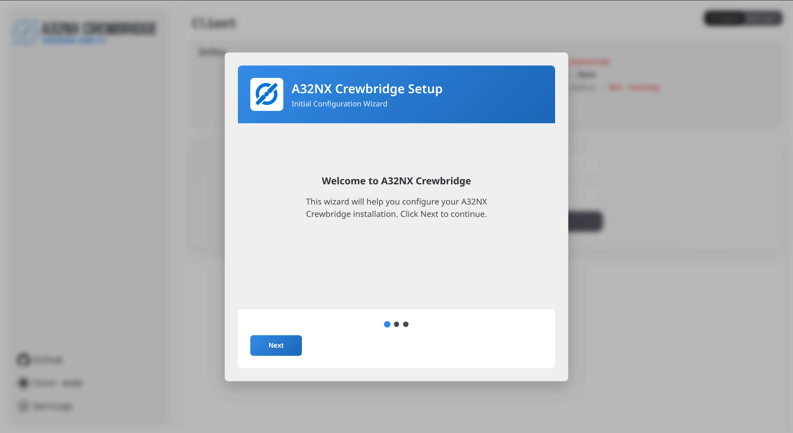
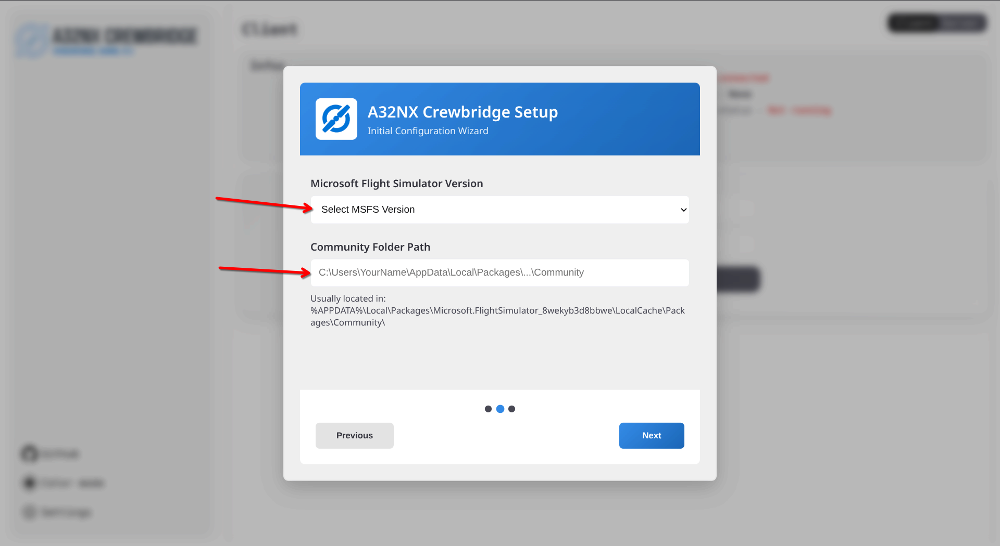
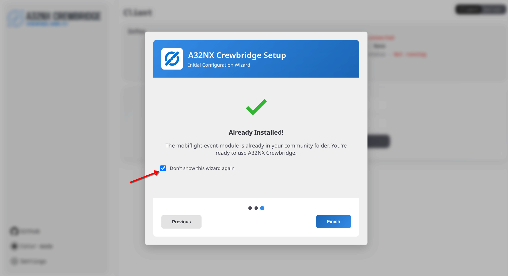
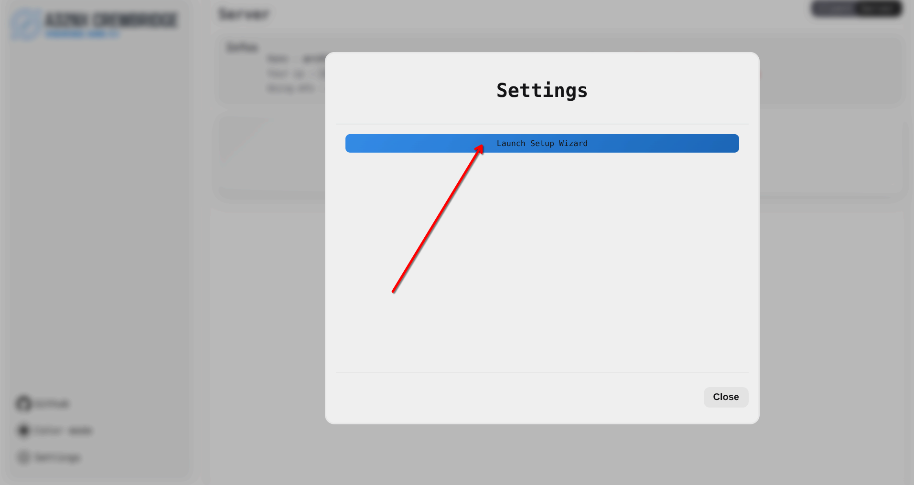
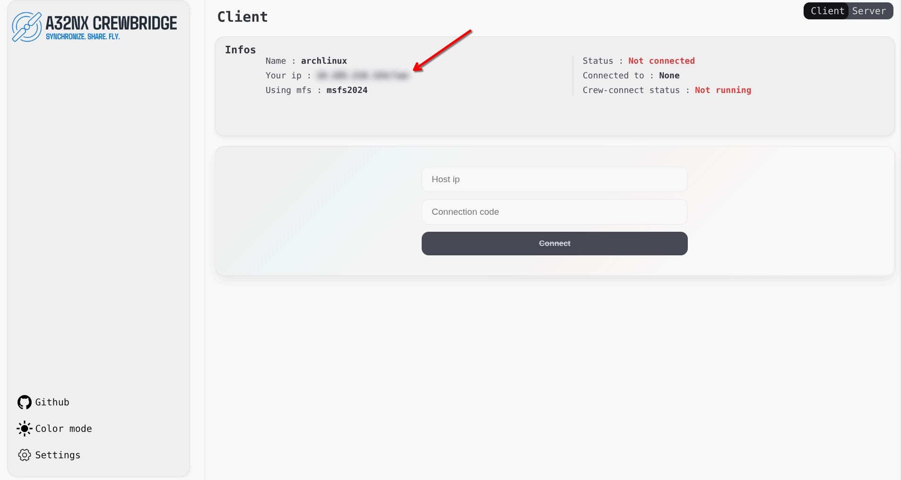
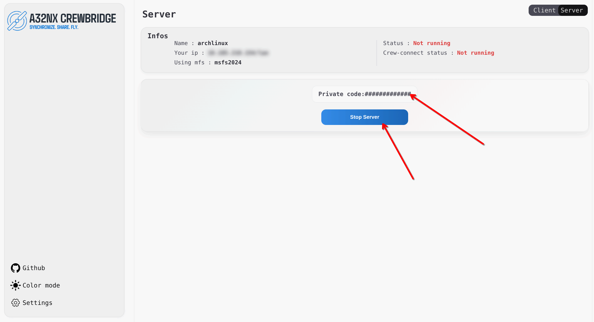
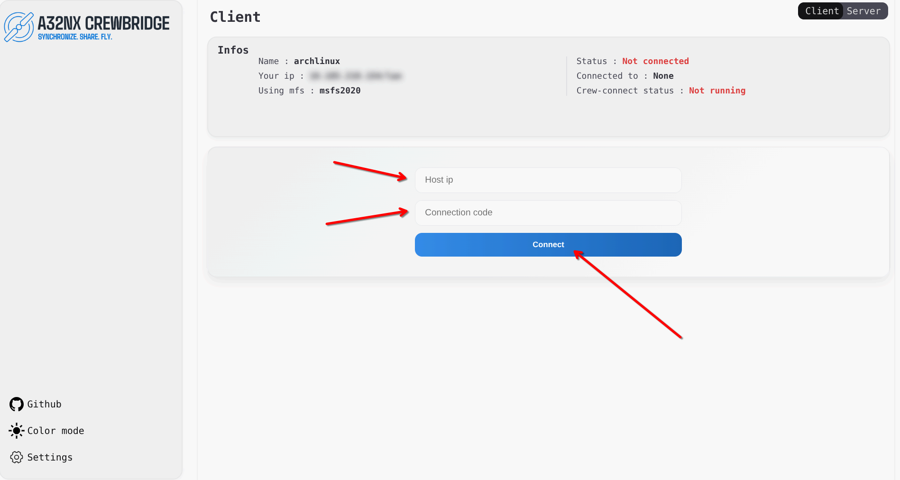

 

  

  <h3 align="center">A32NX-CrewBridge</h3>

<h1>Table of Contents</h1>

  <ul>
    <li><a href="#gtst">Getting Started</a></li>
    <li><a href="#built-with">Built With</a></li>
    <li><a href="#usage">Usage</a></li>
  </ul>

###

<h1 id="gtst"> Getting Started </h1>

First get latest _Crewbridge_ and _Crewconnect_ from [latest release](https://github.com/Nicocraftii/A32NX-crewbridge/releases/latest).
_Crewconnect_ is the backend that communicate with the simulator.
_CrewBridge_ is the app to control and connect to servers and create servers.

## Crewbridge

On first launch you will be prompted with a wizzard to install some dependency.

  

You will get a new page, select you MSFS version and insert your path in the field.

 

Its going to check if you have already the dependency.

 

if you don't have the dependendy you will get a popup to install it . 
**___« WARNING : CLOSE THE SIM BEFORE THE WIZZARD INSTALLATION »___**

 

After the wizzard completed you can check the __Don't show again__

 

## Crewconnect

_Crewconnect_ work in a console it don't require any dependency. 
To start it just launch __Crewconnect.exe__. 
___« make sure to be in an aircraft before launching »___

## Interface

You can activate back the install wizzard by going in _settings_ and clicking _start the wizzard_ 

 

On both server and client you have a status bar that give you infos ; to see you ip click on the blur.

 

 
<h1 id="usage">Usage</h1>

First make sure you have crewconnect running. 

## Server
To be a server (party host) go to the server tab 
Click Start Server and you will get a random code.

 

## Client
To be a client (connect to server) go to the client tab 
Enter the ip ( lan or inet ) in the first field, and enter the code that you friend gave to you.Click on connect.

 

###
###
###

  <h1 align="left">Languages and tools</h1>

  
  

    
    
    
    
    
    
    
    
    
    
    
    
    
  

